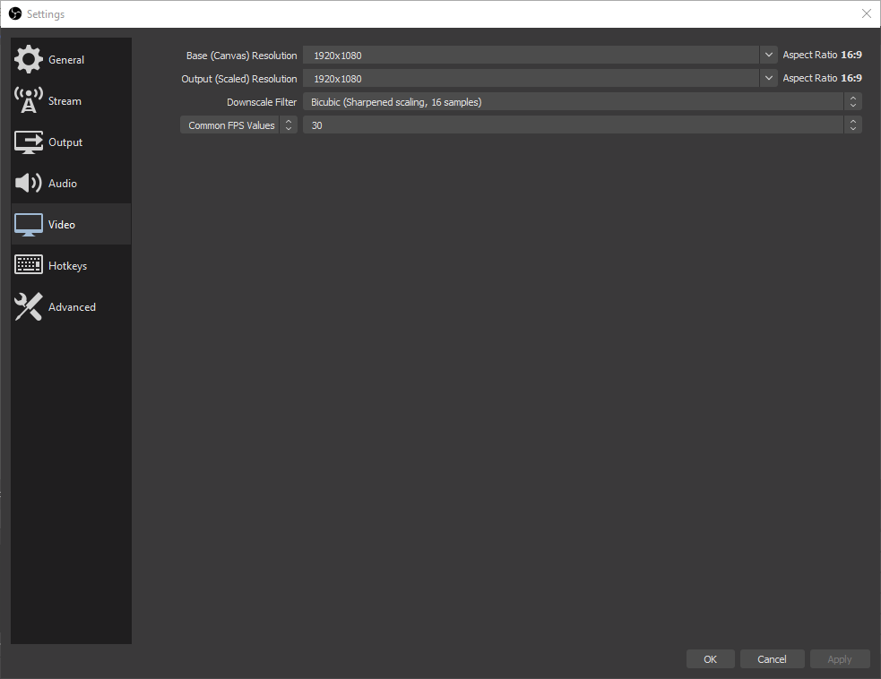
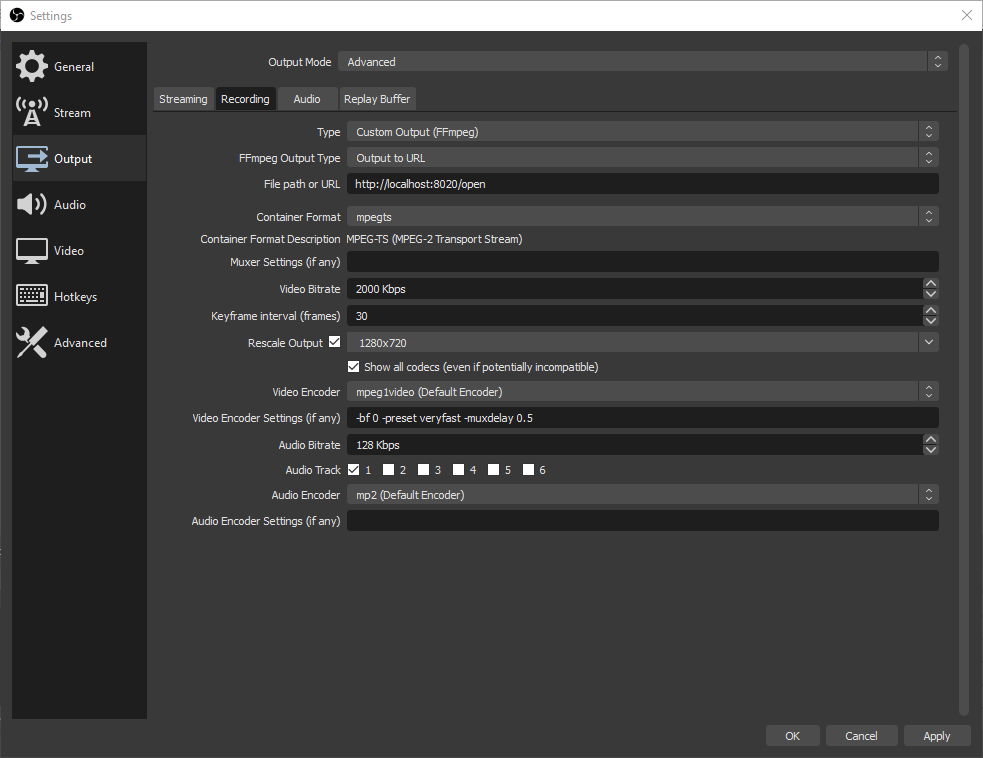

# Screenshare Prototype for Vircadia

## Get Started

You will need:

* Windows/Linux server with NodeJS on it. (Ensure the appropriate ports are open! By default, those are 8020, 8021, and 8022)
* OBS or ffmpeg (I've only tested with OBS so far.)

Begin by cloning this repository to the location that you would like to run the server from.

### Start the Server

First, start the server by navigating to its directory with the terminal or command prompt then:

`node screenshare-relay.js`

By default:

* The server will accept the incoming stream from OBS/ffmpeg on port 8020. The secret path will be 'open', therefore your stream URL will likely be: `http://<your-ip-here>:8020/open`.
* The server will host the client that you use to view the stream (index.html) on port 8022. Therefore, your viewing page URL will likely be `http://<your-ip-here>:8022/index.html`.
* **Technical**: The server will accept client WebSocket connections on port 8021. The secret path to connect to receive stream data will be 'open', therefore your stream viewing WebSocket URL will likely be `ws://<your-ip-here>:8021/open`.

### Start the Stream

Please configure your OBS as the pictures show.

**Note**: *You may customize your configuration, but please only do so if you have a lot of time or know what you are doing! The configuration can yield many different results with many trade-offs. Configuration changes made in OBS may also require changes made to the client page's parameters as well for an optimal experience.*

Typically, the values on this page will be fine left as default.

The only thing that will be different for your setup is that your "File path or URL" field will be specific to you.

### Viewing the Stream

In a web browser or in-world, go to the default URL (unless modified): `http://<your-ip-here>:8022/index.html`

You can adjust the zoom level of a web entity using its `Source Resolution` property. Reduce this value to zoom in to allow the stream to fill the page. The web entity **must** have its `Max FPS` value set to **60** in order to be smooth.

### FAQ

* Q: I can't begin streaming!
* A: Have you checked to make sure that your server has its ports open?

### Extra Client Parameters

You can specify various parameters for the web client page:

* `secret=<websocket-secret>`
* `wsSource=<websocket-source-url>`
* `audioBufferSize=<audio-buffer-size-in-bytes>`
* `videoBufferSize=<video-buffer-size-in-bytes>`
* `chunkSize=<chunk-size-in-bytes>`
* `maxAudioLag=<max-audio-lag-in-seconds>`

Example:

`http://127.0.0.1:8022/index.html?audioBufferSize=2000000` will set the audio buffer to be around 2MB large.

For references on what these parameters do and how you might effectively use them, please see [here](https://github.com/phoboslab/jsmpeg#usage).

### Extra Server Parameters

You can specify various parameters for the server:

* `stream_port=<stream-port>`
* `stream_secret=<stream-secret>`
* `ws_port=<websocket-port>`
* `ws_secret=<websocket-secret>`
* `client_http_port=<client-http-web-port>`

Example:

`node screenshare-relay.js stream_port=4770`

## Libraries

Client
* [jsmpeg](https://github.com/phoboslab/jsmpeg)
* [JQuery](https://jquery.com/)

Server
* [node.js](https://nodejs.org/en/)
    * And the libraries found in the package.json
